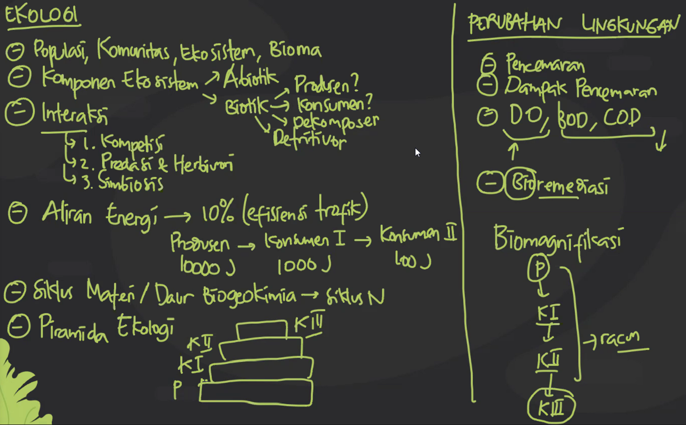

BIO-2021-05-20

# Thursday, May 20, 2021

# **Ekologi dan Perubahan Lingkungan**

## Ekologi
- Bioma | Perbedaannya pada iklim
  - Ekosistem
    - Komunitas
      - Populasi
- Komponen Ekosistem
  - Abiotik (Tidak hidup)
  - Biotik (Hidup)
    - Produsen
    - Konsumen
    - Dekomposer
    - Detritivor
     **Detritivor cuma ngubah sisa-sisa yang besar jadi kecil.
     **Dekomposer menguraikan- organik diubah jadi anorganik.
- Interaksi antarkomponen Ekosistem
  1. Kompetisi
     - Intraspesifik (Spesies sama)
     - Interspesifik (Spesies beda)
  2. Predasi dan Herbivori
     - Predasi | Hewan makan Hewan
     - Herbivori | Hewan makan tumbuhan
  3. Simbiosis
- Aliran Energi
  - Aturan 10% (efisiensi trofik) | Dari 1 tingkatan di rantai makanan
  - Misal Produsen 10.000 J -> Konsumen I 1.000 J -> Konsumen II 100 J
- Siklus Materi / Daur Biogeokimia
  - ### ***Daur Nitrogen Sering Keluar**
  - Kadang ada siklus air
- Piramida Ekologi
---
## Perubahan Lingkungan
- Pencemaran
- Dampak pencemaran
- DO (*Dissolved Oxygen*) | Berapa banyak oxigen yang tersedia, BOD (*Biological Oxygen Demand*), COD (*Chemical Oxygen Demand*) | Berapa banyak oxigen yang dibutuhkan.
  - Perairan sehat kalau DO tinggi dan BOD & COD rendah.
- Bioremediasi | Memperbaiki lingkungan dengan memanfaatkan makhluk hidup.

LAST:
Cacing perut nyebabin