ENG-2021-05-19

# Wednesday, May 19, 2021

## Main Idea & Topic, Choosing a title

Points:
  - Topic
    - Kata yang diulang-ulang
    - Arti kata yang diulang tapi dengan kata yang berbeda
Tips buat listening:
1. Sering-sering dengerin lagu, film, drama.
2. Nonton pakenya subtitle bahasa Inggris

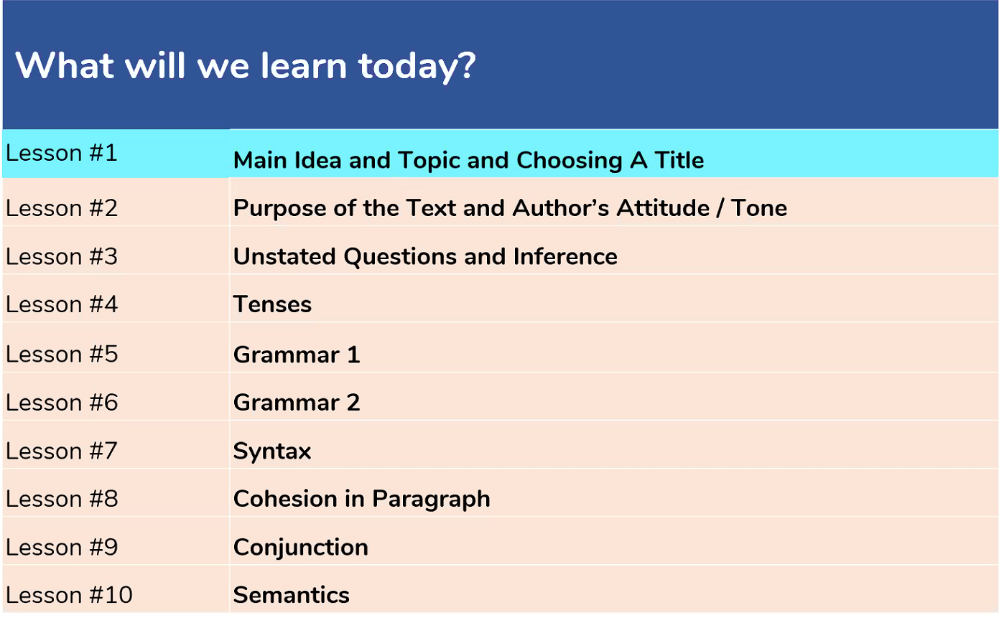
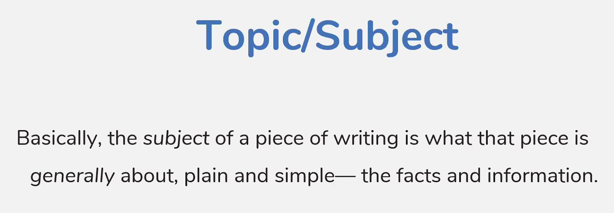
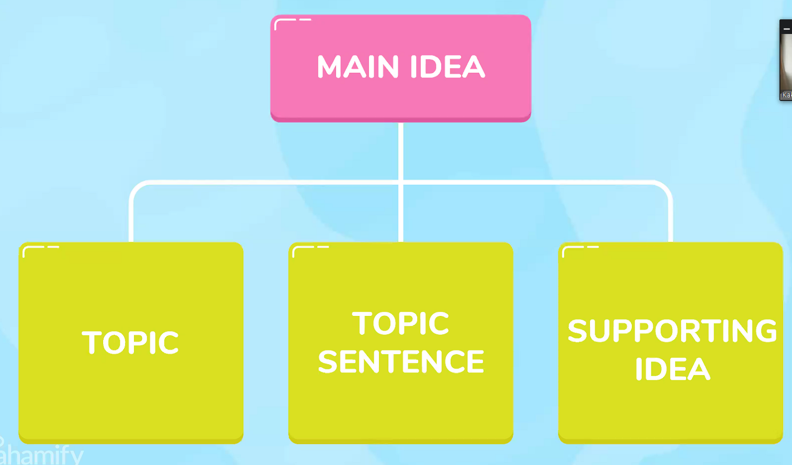
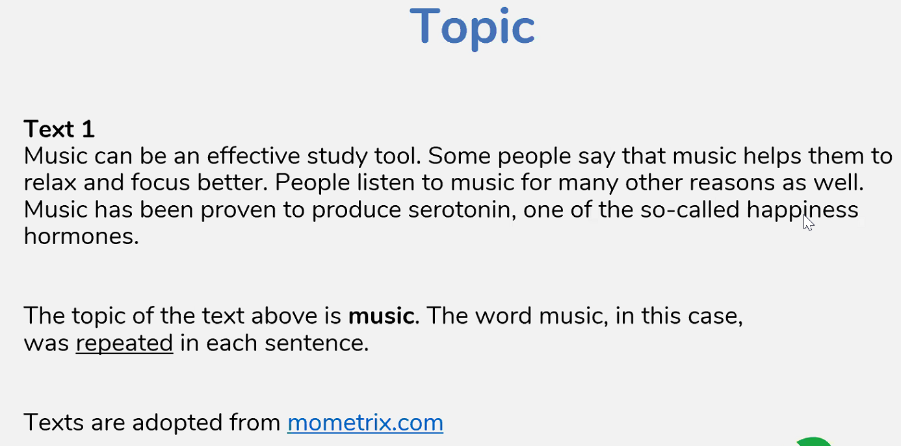
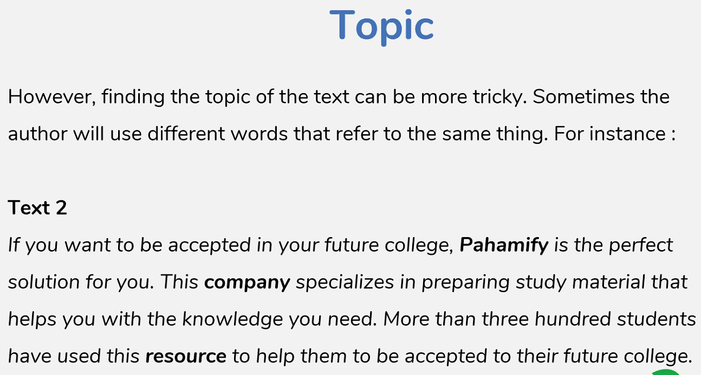

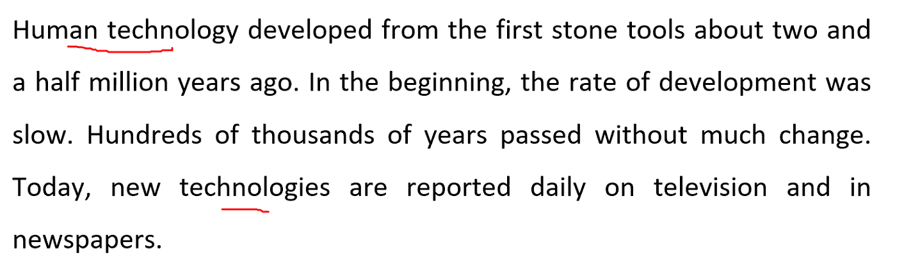
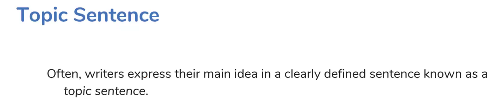
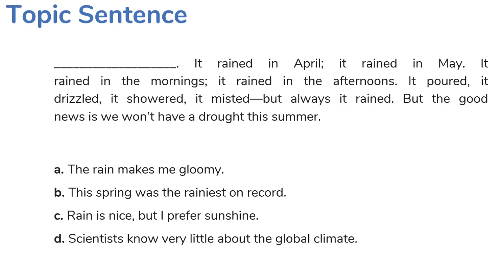
> - [ ] A : Gloomy tidak dijelaskan
> - [x] B : Jawaban Paling Benar
> - [ ] C : Prefer tidak dijelaskan
> - [ ] D : Scientists tidak disebutkan

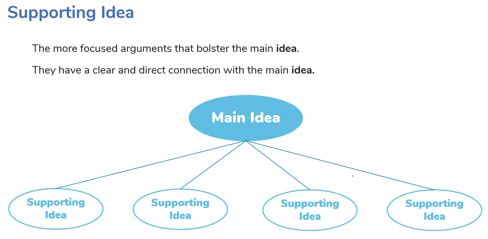
Menentukan main idea :
  - Adakah supporting idea yang menjelaskan main ideanya.

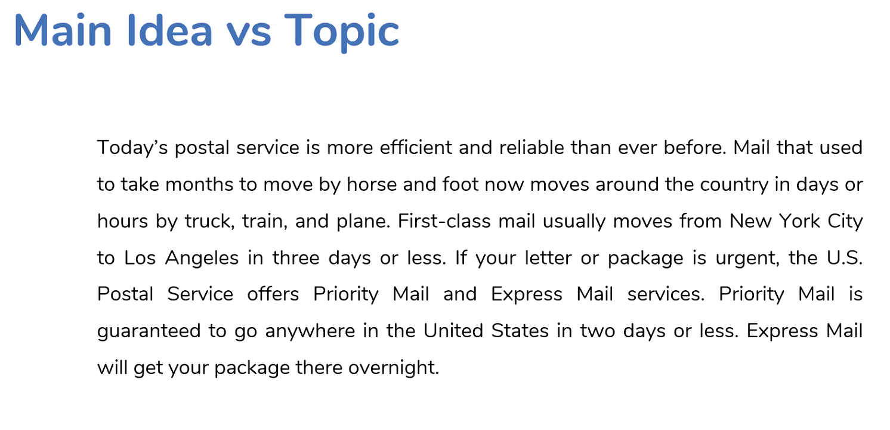
* Topicnya "postal service".
* Main ideanya ada di kalimat utama (kalimat pertama).

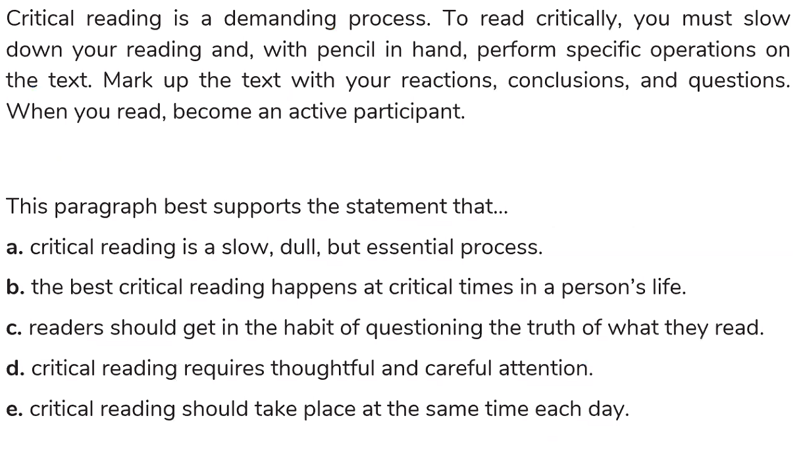
> - [ ] A : Dull X
> - [ ] B : Critical times X
> - [ ] C : Questioning X
> - [x] D : V
> - [ ] E : The same time each day X

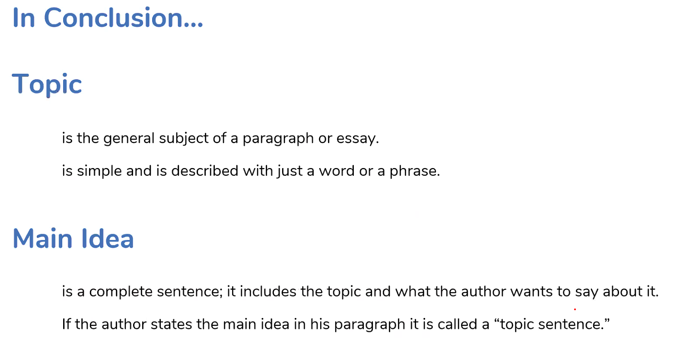

## Choosing A title
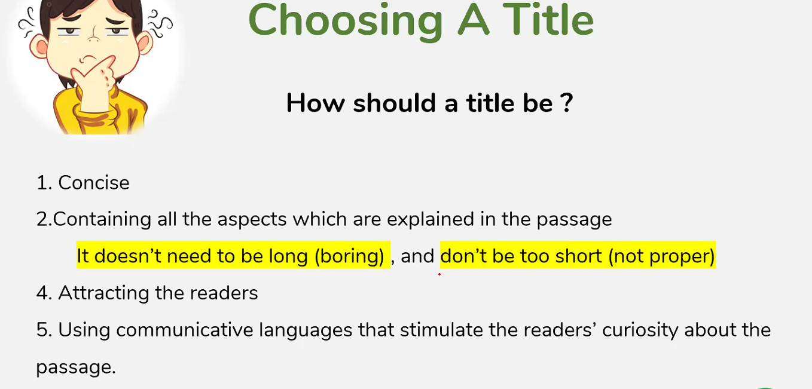
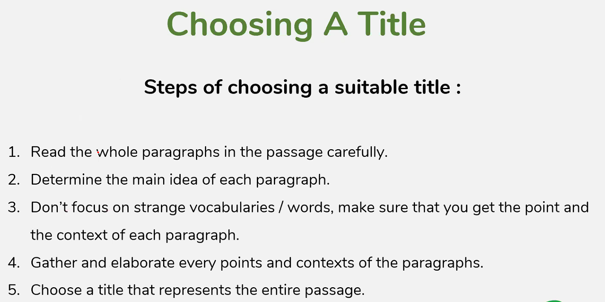
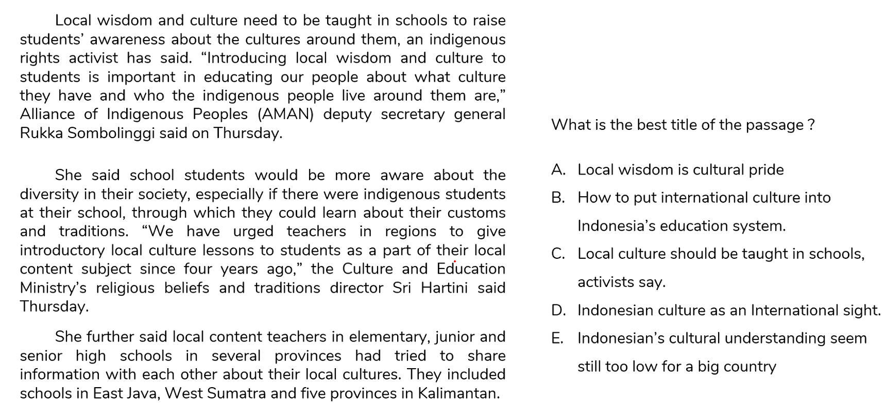

> - [ ] A : 
> - [ ] B : 
> - [x] C : 
> - [ ] D : 
> - [ ] E :