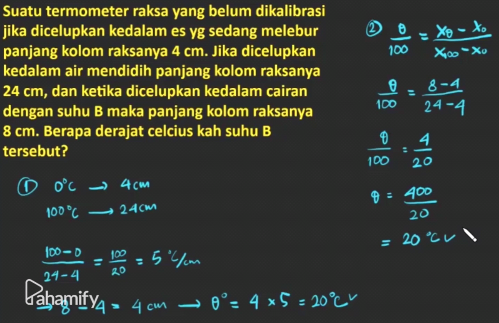
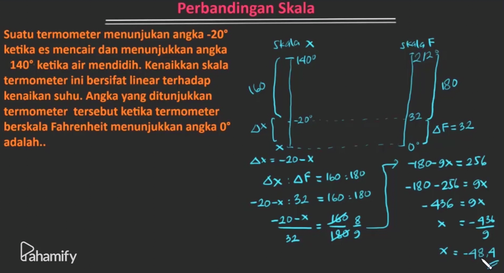
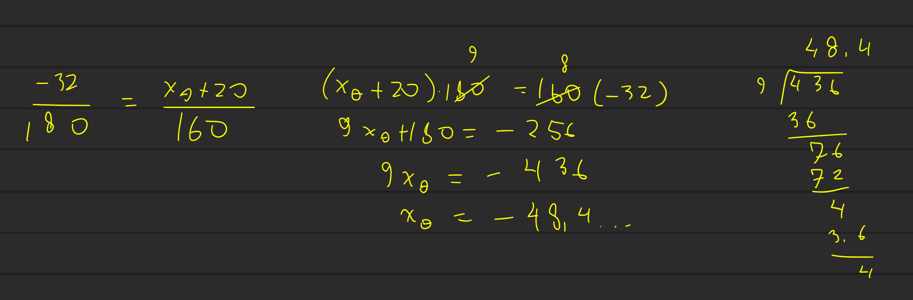
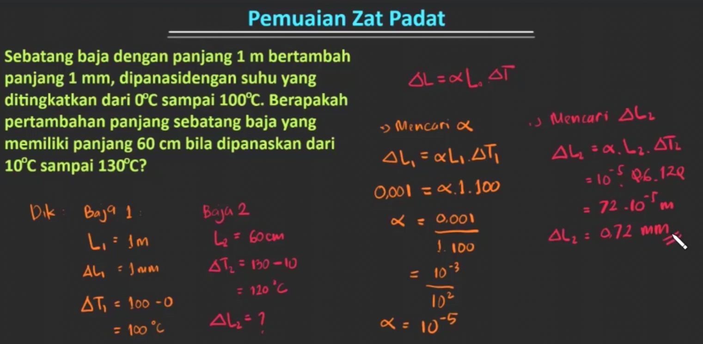
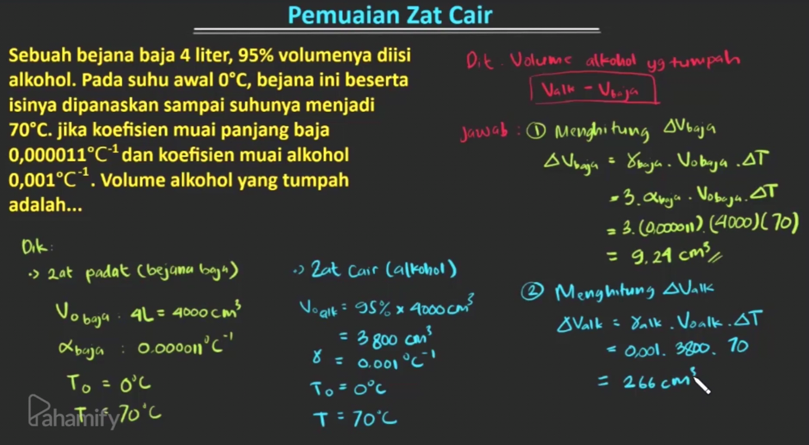
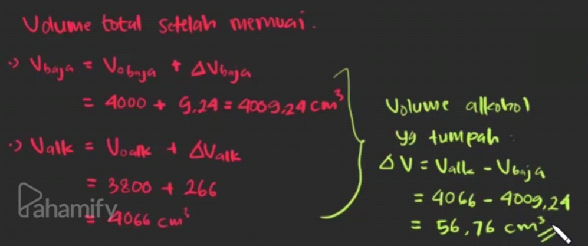
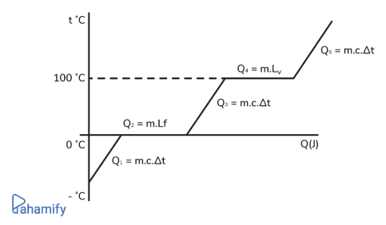

---
# Suhu, Gas, dan Termodinamika

## Suhu dan Macam-macam Pemuaian Zat
### SUHU DAN SKALA SUHU
**Suhu** adalah derajat panas atau dingin suatu benda. Semakin panas benda, maka semakin tinggi suhunya. 
Suhu bisa dinyatakan dalam 3 skala :
-   Skala Celcius, dengan titik lebur es $0^{\circ}C$ dan titik didih air $100^{\circ}C$.
-   Skala Fahrenheit, dengan titik lebur es $32^{\circ}\text{F}$ dan titik didih air $212^{\circ}\text{F}$. Hubungan antara skala fahrenheit dan skala celcius bisa dinyatakan dalam persamaan:
$[t_F-32]:t_C=9:5$
-   Skala Kelvin, atau disebut juga skala mutlak yang ditetapkan sebagai satuan SI. Hubungannya dengan skala celcius bisa dinyatakan dengan persamaan :
$T=t_C+273$

### SUHU TERMOMETER
Salah satu contoh termometer yang biasa dipakai adalah termometer raksa, yaitu termometer yang terbuat dari gelas kaca dan diisi oleh zat cair. 
Hubungan linear antara panjang kolom raksa dan kenaikan suhu bisa dinyatakan dalam persamaan:
$$\frac{\theta}{100}=\frac{X_\theta-X_0}{X_{100}-X_0}$$

### PEMUAIAN ZAT
Jika suhu dinaikan, partikel-partikel penyusun suatu benda akan bergetar kuat dan akhirnya saling menjauh, sehingga benda akan memuai. Sebaliknya, jika suhu diturunkan, getaran partikel penyusun zat akan melemah dan akhirnya kembali saling mendekat yang mengakibatkan benda menyusut. Fenomena perubahan suhu ini lah yang menyebabkan pemuaian dan penyusutan, baik pada zat padat, zat cair, maupun gas.

#### A. Muai Panjang

Perubahan suhu yang menyebabkan benda mengalami pertambahan panjang. Muai panjang ini hanya terjadi pada zat padat.
Dinyatakan dengan persamaan:
$$\triangle l = \alpha\cdot l_o\cdot\triangle t$$
$\triangle l$ = Pertambahan panjang benda (m)

$\alpha$ = Koefisien muai panjang benda ($/^{\text{o}}\text{C}$)
*tergantung material benda

$l_o$= Panjang awal benda (m)

$\triangle t$ = Perubahan suhu ($^{\text{o}}\text{C} $)

Contoh :

-   Rel kereta api yang dibuat bercelah agar ketika suhu tinggi yang menyebabkan batang rel memanjang tidak akan membuat antar batang rel bertabrakan dan membengkok.
-   Pemasangan kabel listrik dibuat kendor agar ketika malam hari saat suhu rendah, kabel yang mengalami penyusutan tidak akan putus.
#### B. Muai Luas
Perubahan suhu yang menyebabkan benda mengalami pertambahan luas. Muai luas hanya terjadi pada zat padat.
Dinyatakan dengan persamaan:
$$\triangle A = \beta\cdot A_o\cdot\triangle t$$
$\triangle A$ = Pertambahan luas benda ($\text{m}^2$)
$\beta$ = Koefisien muai luas benda ($/^{\text{o}}\text{C}$)
*tergantung material benda, ($\beta = 2\alpha$)
$A_o$=Luas awal benda ($\text{m}^2$)
$\triangle t$ = Perubahan suhu ($^{\text{o}}\text{C}$)

Contoh :

Pemasangan jendela yang diberi celah antara kaca dan bingkai nya agar ketika kaca mengalami pertambahan luas, kaca tidak akan pecah karena tertahan dengan bingkai.

#### C. Muai Volume
Perubahan suhu yang menyebabkan benda mengalami pertambahan volume. Muai volume ini bisa terjadi pada zat padat, zat cair, maupun gas.
Pada zat padat dan zat cair pemuaian volume dapat dinyatakan dengan persamaan:
$$\triangle l = \gamma\cdot V_o\cdot\triangle t$$
$\triangle V$ = pertambahan volume benda ($\text{m}^3$)
$\gamma$ = Koefisien muai volume benda ($/^{\text{o}}\text{C}$)
*tergantung material benda, ($\gamma = 3\alpha$)
$V_o$=Volume awal benda ($\text{m}^3$)
$\triangle t$ = perubahan suhu ($^{\text{o}}\text{C}$)

Contoh :

Minuman kaleng yang tidak pernah terisi penuh untuk mengantisipasi ketika air mengalami pemuaian volume, kaleng masih bisa menampung (tidak tumpah).

#### D. Muai Gas

Perubahan suhu yang menyebabkan zat berwujud gas mengalami pertambahan volume, meskipun tekanan tetap (Isobarik), atau perubahan tekanan pada volume yang tetap (Isokhorik). 

Proses Isobarik dapat dinyatakan dengan persamaan:
$$\frac{V_1}{T_1}=\frac{V_2}{T_2}$$
Proses Isokhorik dapat dinyatakan dengan persamaan:
$$\frac{P_1}{T_1}=\frac{P_2}{T_2}$$
Persamaan umum keadaan gas:
$$\frac{P_1 V_1}{T_1} = \frac{P_2 V_2}{T_2}$$
$P_n$= Tekanan gas pada keadaan tertentu (atm) atau (Pa)
$V_n$= Volume gas pada keadaan tertentu (Ltr)
$T_n$= Suhu gas pada keadaan tertentu (K)

Contoh :

Ban motor yang tidak diisi penuh oleh angin agar ketika angin mengalami pemuaian volume, ban tidak meledak.

## Kumpulan Rumus:
[placeholder]

## Suhu dan Kalor

[placeholder]

### Soal Suhu Termometer
>$\theta$ = Suhu
$\frac{\theta}{x_{\text{tujuan}{100}}} = \frac{x_\theta-x_0}{x_{100}-x_0}$

### Soal Perbandingan Skala
>$\frac{\theta}{x_{\text{tujuan}{100}}} = \frac{x_\theta-x_0}{x_{100}-x_0}$

atau:

### Soal Pemuaian Zat Padat
>$\Delta L = \alpha L_0 \cdot \Delta T$
- $\Delta L =$
- $\alpha =$
- $L =$
- $\Delta T =$

### Soal Pemuaian Zat Cair
>$\Delta L = \alpha L_0 \cdot \Delta T$

## Kalor dan Perpindahan Kalor

### Kalor
**Kalor** adalah energi yang berpindah dari satu sistem ke sistem lainnya karena ada **perbedaan suhu**. Kalor akan berpindah dari benda yang suhunya tinggi ke yang suhunya lebih rendah. 
Satuan internasional kalor adalah Joule dimana satu kalori sama dengan 4186 Joule. ($1\space\text{kal}=4186\space\text{J}$)

### Perpindahan Kalor
Secara umum, besarnya perpindahan kalor dapat dinyatakan dengan persamaan:
$$Q=m\cdot c\cdot\triangle T$$
$m$ = Massa zat yang menerima atau melepas kalor (kg)
$c$ = Kalor jenis zat ($\text{J/kg}^{\text{o}}\text{C}$)
$\triangle T$ = Perubahan suhu  ($^{\text{o}}\text{C}$)

### Kapasitas Kalor

Kapasitas kalor adalah jumlah kalor yang diserap oleh benda bermassa tertentu untuk menaikkan suhu sebesar $1^{\text{o}}\text{C}$.

Kapasitas kalor dapat dinyatakan dengan persamaan:
$$C = m\cdot c \text{ atau } C = \frac{Q}{\triangle T}$$

$C$ = Kapasitas kalor ($J/K$)
$Q$ = Banyaknya kalor ($J$)
$\triangle T$ = Perubahan suhu ($K$)

###Asas Black
Untuk mencapai kondisi **kesetimbangan termal** pada suatu pencampuran zat, maka besarnya kalor yang dilepaskan zat satu harus sama dengan besarnya kalor yang diterima oleh zat dua.
$$Q_{lepas}=Q_{terima}$$

$Q_{lepas}$ adalah jumlah kalor milik zat dengan suhu lebih tinggi dari zat lainnya dan $Q_{terima}$ adalah jumlah kalor milik zat dengan suhu lebih rendah dari zat lainnya. Dengan mengadopsi rumus besarnya perpindahan kalor, maka persamaan asas black menjadi :
$$m_{lepas}\cdot c_{lepas}\cdot\triangle T = m_{terima}\cdot c_{terima}\cdot \triangle T$$

​$$m_{lepas}\cdot c_{lepas}\cdot (T_{lepas} - T_{campuran}) = m_{terima}\cdot c_{terima}\cdot (T_{campuran} - T_{terima})$$

$$$Perubahan Wujud
Perubahan suhu dapat menyebabkan wujud dari suatu zat berubah. Contohnya pada air.

Pada grafik di atas, air mengalami perubahan wujud seiring dengan kenaikan suhu yang diberikan. Proses perubahan wujud tersebut tentunya terjadi karena adanya perpindahan kalor, yang jika dilihat pada grafik di atas, terdiri dari lima tahap perpindahan kalor.
1. $Q_1$$(-^{\text{o}}\text{C}$ sampai $0^{\text{o}}\text{C}0 $)

Pada fase ini air berbentuk zat padat (es). Besarnya perpindahan kalor:
$$Q=m\cdot c\cdot \triangle TQ=m⋅c⋅△T$$

2. $Q_2(0^{\text{o}}\text{C}$)

Pada fase ini, es mulai mengalami perubahan wujud, yaitu mencair. Besarnya perpindahan kalor:
$$Q=m\cdot L_f$$
di mana $L_f$ adalah kalor lebur ($J/kg$)

3. $Q_3$($0^{\text{o}}\text{C}$ sampai $100^{\text{o}}\text{C}$)

Pada fase ini wujud air sudah menjadi zat cair. Besarnya perpindahan kalor:
$$Q=m \cdot c\cdot \triangle T$$

4. $Q_4$($100^{\text{o}}\text{C}$)

Pada fase ini, air mulai mengalami perubahan wujud, yaitu menguap. Besarnya perpindahan kalor:
$$Q=m\cdot L_v$$
di mana $L_v$ adalah kalor didih ($J/kg$)

5. $Q_5$($100^{\text{o}}\text{C}$ sampai $t^{\text{o}}\text{C}t$)

Pada fase ini air akan terus mengalami penguapan seiring bertambahnya suhu yang diberikan. Besarnya perpindahan kalor:
$$Q=m \cdot c\cdot \triangle T$$

### CARA PERPINDAHAN KALOR

#### A. Konduksi

Proses perpindahan panas melalui benda padat.

Dalam persamaan, jumlah kalor yang berpindah dalam satuan waktu adalah:

$$\frac{Q}{t}=\frac{k\cdot A\cdot \Delta T}{L}$$
$\frac{Q}{t}$ = Laju kalor konduksi ($J/s$)

$k$ = Konduktivitas termal zat ($W/m K$ atau $W/m^{\text{o}}\text{C}$)
$A$ = Luas permukaan zat ($\text{m}^2$)
$\triangle T$ = Perbedaan suhu ($K$ atau $^{\text{o}}\text{C}$)
$L$ = Ketebalan suatu zat ($m$)

Contoh : ujung sendok yang didekatkan dengan lilin lama kelamaan ujung sendok yang lainnya akan terasa panas.

#### B. Konveksi 
Proses perpindahan panas melalui benda cair dan gas.

Dalam persamaan, jumlah kalor yang berpindah dalam satuan waktu adalah:
$$\frac{Q}{t}=h\cdot A\cdot \Delta T$$

$\frac{Q}{t}$ = Laju kalor konveksi ($J/s$)
$h$ = Koefisien konveksi ($\text{J/s}\space\text{m}^2\space\text{K}$)
$A$ = Luas permukaan zat ($\text{m}^2$)
$\triangle T$ = Perbedaan suhu ($K$ atau $^{\text{o}}\text{C}$)

Contoh : adanya angin darat dan angin laut, proses memanaskan air dalam teko.

#### Radiasi
Perpindahan panas tanpa melalui zat perantara (melalui gelombang elektromagnetik).

Dalam persamaan, jumlah kalor yang berpindah dalam satuan waktu adalah:
$$\frac{Q}{t}=e\cdot \sigma\cdot A\cdot T^4$$

$\frac{Q}{t}$ = Laju kalor radiasi ($J/s$)
$e$ = Emisivitas atau kemampuan suatu benda untuk memancarkan radiasi kalor dibandingin sama benda hitam sempurna (e = 1). Emisivitas tidak punya satuan, dan nilainya berkisar antara 0 dan 1 ($0\leq e\leq 1$), tergantung jenis zatnya. Makin besar nilai emisivitasnya, makin besar benda tersebut memancarkan radiasi.
$\sigma$ = Tetapan Stefan Boltzmann; dalam satuan SI nilainya sama dengan $5{,}67\times 10^{-8}W/m^2\text{K}^4$
$A$ = Luas permukaan benda ($\text{m}^2$)
$T$ = Suhu benda ($K$)

Contoh : cahaya matahari yang menyinari bumi.

### Soal Asas Black

