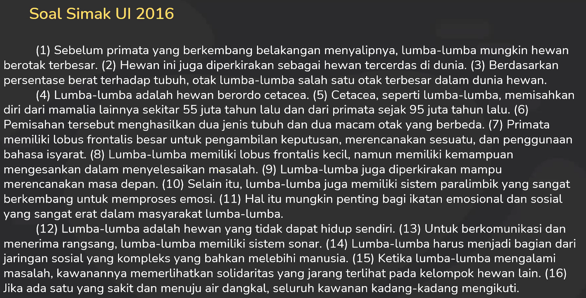
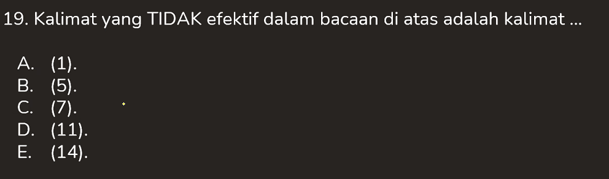
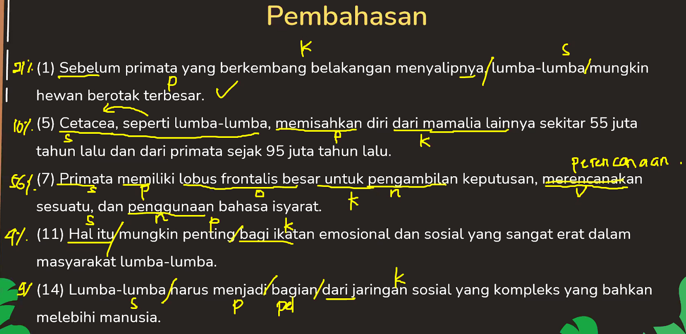
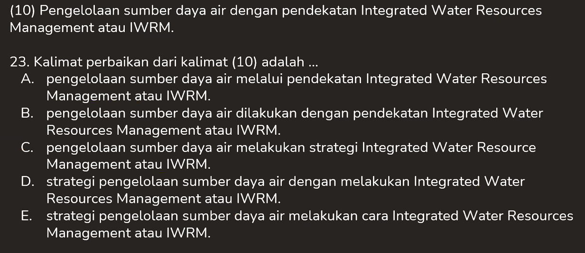

IND-2021-05-21

# Friday, May 21, 2021

# **Kalimat Efektif dan Kalimat Baku**

-   Kalimat efektif
    -   Kalimat yang disusun secar atepat sehingga mudah dipahami
        Syarat Kalimat Efektif (yang paling penting)
        1. Kesepadanan => Pola kalimat
           Kalimat yang tidak sepadan:
           1. Tidak ada S
           2. Tidak ada P 
           3. Tidak ada S-P 
           4. Hubungan S-P tidak jelas
        2. Kehematan => Penggunaan kata
           1. Pengulangan subjek
              - Ayu tidak masuk karena ~~dia~~ sakit
           2. Menjamakkan kata yang sudah jamak
              - ~~Para~~ ibu-ibu
           3. Menggunakan kata-kata yang memiliki makna sama
              - Dia belajar agar ~~supaya~~ pandai
           4. Pleonasme -> meenjelaskan kata yang sudah jelas
              - Maju ~~ke depan~~
           5. Sudah termasuk dalam kata umumnya (hideprnim - hiponim)
              - Saya berangkat pada hari ~~Kamis~~.
              - Saya membeli __~~bunga~~__ mawar.
        3. Kelogisan  
           Kalimat efektif arus bernalar atau logis. Kalimat yang tidak logis tidak bisa disebut sebagai kalimat efektif. Kalimat yang memiliki makna ganda (ambigu) pun tidak bisa disebut sebagai kalimat efektif.
           Contoh:
            1. Korban kecelakaan ~~dilarikan~~ ke rumah sakit
               >    dilarikan -> dibawa
            2. ~~UKT mahasiswa baru dinaikkan~~
               >    UKT mahasiswa baru -> UKT-mahasiswa baru
               >    UKT mahasiswa baru -> UKT mahasiswa-baru dinaikkan.
               
            ber+revolusi = be-revolusi
            ber+evolusi  = ber-evolusi
        4. Kesejajaran 
           Kesejajaran mengacu pada jenis kata/frasa yang dipakai dalam sebuah kalimat.
           Contoh:
            1. ~~Mencegah~~ lebih baiik daripada ~~pengobatan~~
              > Mencegah -> Pencegahan atau
              pengobatan -> mengobati
            2.  Wartawan bertugas mencari berita, menulis sesuai dengan fakta, serta pengecekan kebenaran berita.
                >   "mencari", "menulis", "~~pengecekan~~"
                >   pengecekan -> mengecek
                
-   Kalimat baku
    >   Kalimat baku = Kalimat efektif + ejaan
    >   Perbaikan kalimat = Kalimat baku

---
## **Soal**
---
1. 
-  

2. 
-  