# Tata Nama Senyawa dan Hukum Dasar Kimia
Saat ini sudah banyak senyawa yang dikenal dan ditemukan. IUPAC (International Union of Pure and Applied Chemistry) merumuskan tata nama kimia yang didasarkan pada aturan yang sudah dibuat, dengan tujuan keseragaman.

- ## Tata Nama Senyawa Anorganik Sederhana
  Tersusun dari semua atom yang ada di tabel periodik unsur. Umumnya menyusun material/benda mati, misalnya zat-zat garam, udara, air..
   - Kompleks 
   - Sederhana
     - ## Senyawa Biner
       - ## Senyawa Biner Ionik
         - Tersusun dari ion logam (kation) dan nonlogam (anion)
           >  **Nama logam ~ Anion**

           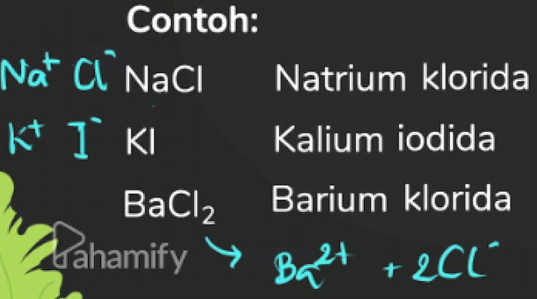
           >  **Tabel ion positif**

           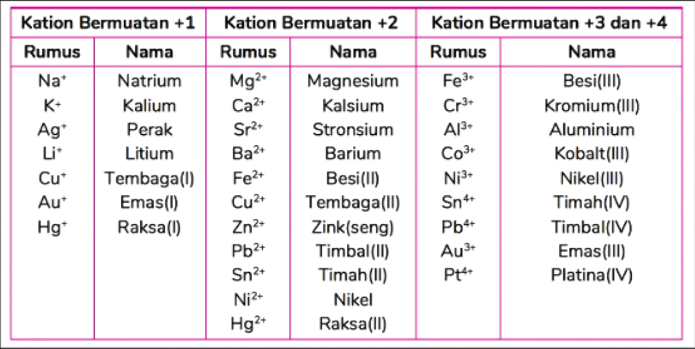
           >  **Tabel ion negatif**

           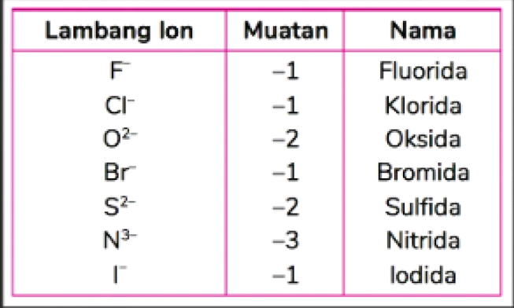
       - ## Senyawa Biner Kovalen
         - Tersusun dari unsur nonlogam dan nonlogam
         - **Awalan Yunani ~ Nama nonlogam pertama ~ awalan Yunani ~ nama nonlogam kedua ~ ida**
         - Berurutan dari kiri ke kanan:
             > $$B-Si-C-Sb-As-P-N-H-S-I-Br-Cl-O-F$$
             misal:
             > $$H_2O,NH_3$$
             bukan
             > $$OH_2,H_3N$$
         - Angka Indeks:
           1. **Mono** (Tidak perlu disebutkan kecuali karbon monoksida)
           2. **Di**
           3. **Tri**
           4. **Tetra**
           5. **Penta**
           6. **Heksa**
           7. **Hepta**
           8. **Okta**
           9. **Nona**
           10. **Deka**
          Kecuali: 
             >  $$H_2O, NH_3, CH_4$$
          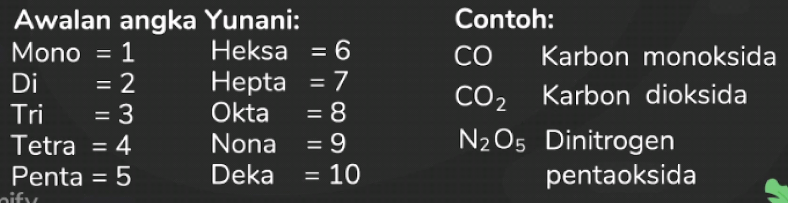
      - ## Senyawa Poliatom
        - ## Senyawa poliatom ionik
          > - **Nama kation ~ Anion**

          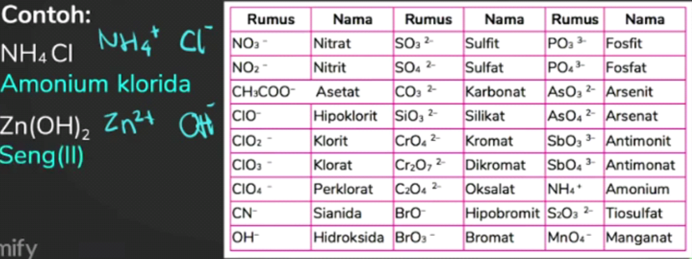
        - ## Senyawa Asam
          > - **Asam ~ nama anion**

          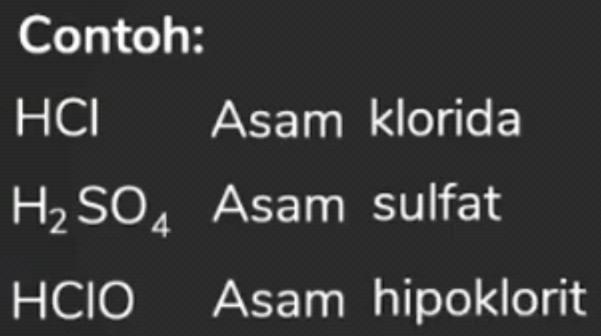
      - ## Senyawa Hidrat
        > - **Nama kation ~ nama aniona ~ awalan Yunani ~ hidrat**

        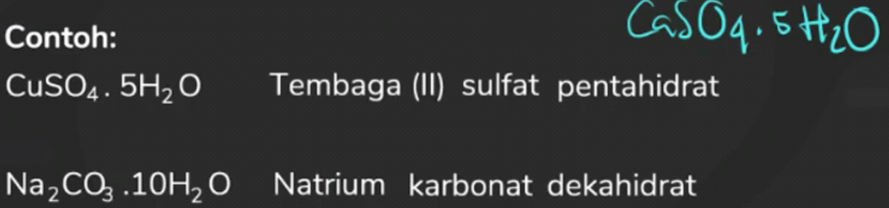
      - ## Senyawa Ion
        - ## Kation (Ion +)
          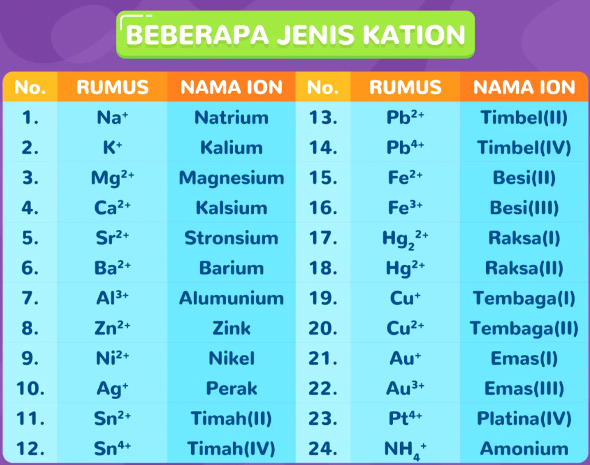
        - ## Anion (Ion -)
        
        - Penamaannya **Kation + Anion**
        - Ion yang memiliki indeks lebih dari satu, angka indeks tidak perlu disebutkan.
        - Kation yang memiliki biloks lebih dari satu bersifat unik. Dia dapat berikatan dengan banyak jenis atom: **Kation(Biloks) + Anion**
        Misal:
        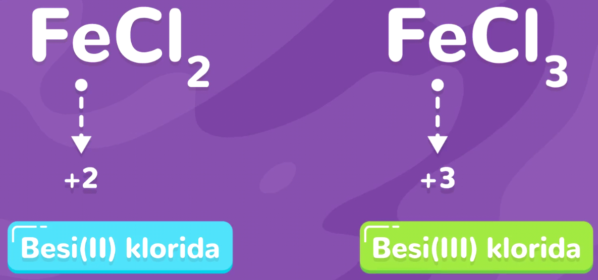
      - ## Senyawa Asam dan Basa
        > - ## Asam | Senyawa hidrogen yang bersifat masam di dalam Aliran
        ## **HIDROGEN + ANION**
        - Senyawa molekul (bukan ion)
        - Ikatan kovalen (bukan ikatan ion)
        - Penamaan anion tetap mengikuti aturan senyawa ion
        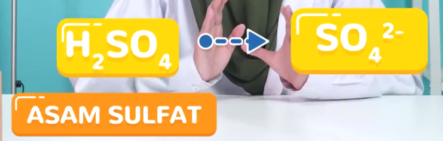
        > -  ## Basa | Senyawa Ion yang terbentuk dari suatu logam dengan ion hidroksida ata OH-

        
        > - **KATION(BILOKS) + HIDROKSIDA**
        
        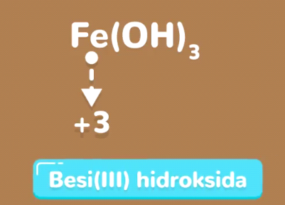
- Tata Nama Beberapa Senyawa Organik
   Tersusun dari atom atau karbon yang membentuk rantai dan biasanya mengikat atom hidrogen, oksigen, atau fosfor. Umumnya sebagai penyusun makhluk hidup: Protein, karbohidrat, lemak
     - Senyawa Organik | Tersusun dari atom-atom karbon yang membentuk rantai, biasanya mengikat hidrogen, oksigen, atau fosfor
       - Punya nama yang unik, misalnya
       
       Contoh yang paling sering kita gunakan adalah bahan bakar kendaraan.

## **Hukum Dasar Kimia**
-  Hukum Kekekalan Massa
   >   -  Dalam reaksi kimia **massa zat sebelum reaksi sama dengan massa zat setelah reaksi** (Antoine Laurent Lavoisier) | Dalam sistem tertutup

   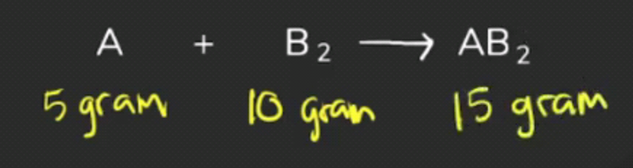
-  Hukum Perbandingan Tetap
   >   -  **Perbandingan massa unsur-unsur di dalam senyawa itu tertentu dan tetap**
   >   -  **Senyawa yang sama akan mempunyai komposisi yang sama, walaupun sumber dan ditempatkannya beda.** (Joseph Louis Proust)

   
   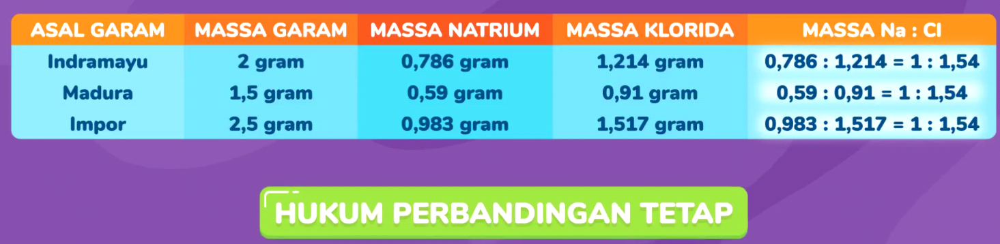
   -  Contoh:
      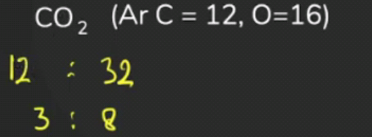
   -  Menentukan Massa/Persentase Unsur dalam Senyawa
      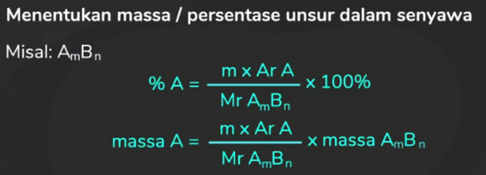
      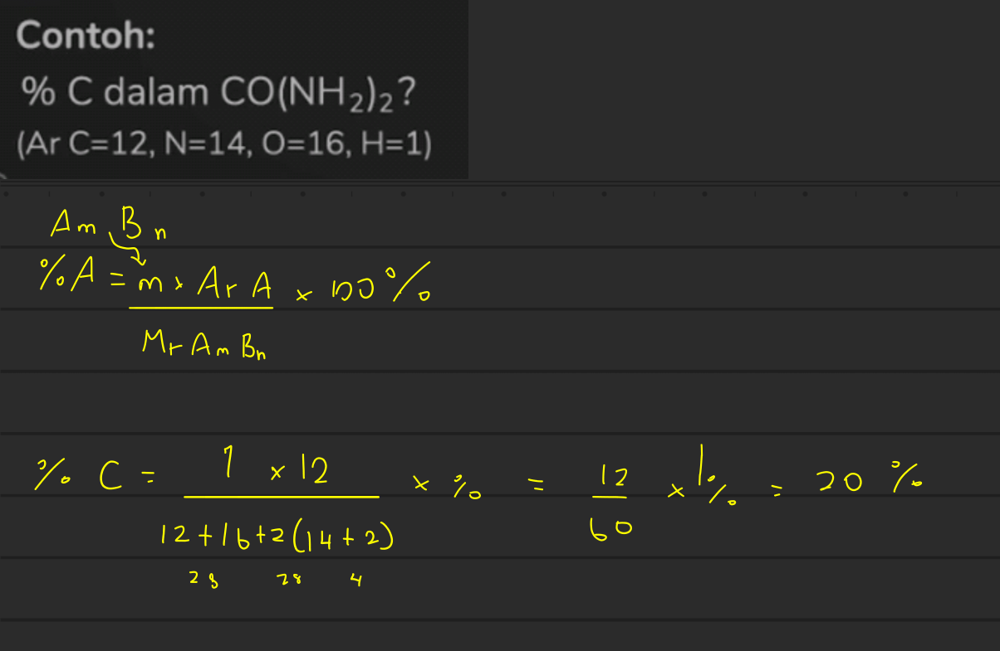
-  Hukum Kelipatan berganda 
   > - **Jika massa salah satu unsur dalam dua senyawa itu sama, perbandingan massa unsur satu lagi dalam kedua senyawa itu merupakan bilangan bulat yang sederhana** (John Dalton)
   > - **Jika dua jenis unsur dapat membentuk lebih dari satu senyawa, dan massa salah satu unsurnya sama, maka perbandingan masa unsur lainnya merupakan bilangan bulat dan sederhana**
   
   
   Kalau kita punya dua senyawa, CO dan CO2, dan massa karbonnya sama-sama 1, maka massa O-nya akan menjadi 1 : 2.
   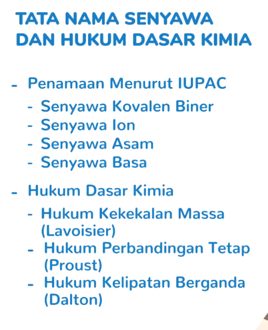 
   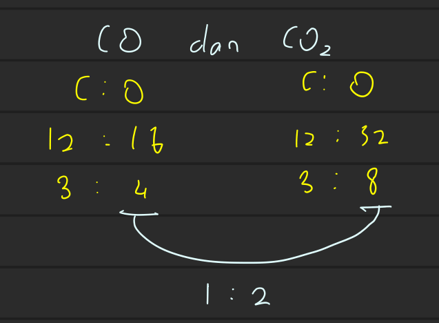
-  Hukum Perbandingan Volume
   >  -  **Bila diukur pada P dan T yang sama, volume gas-gas yang bereaksi dan gas hasil reaksi merupakan perbandungan bulat dan sederhana**
   ## Perbandingan koefisien = perbandingan volume
   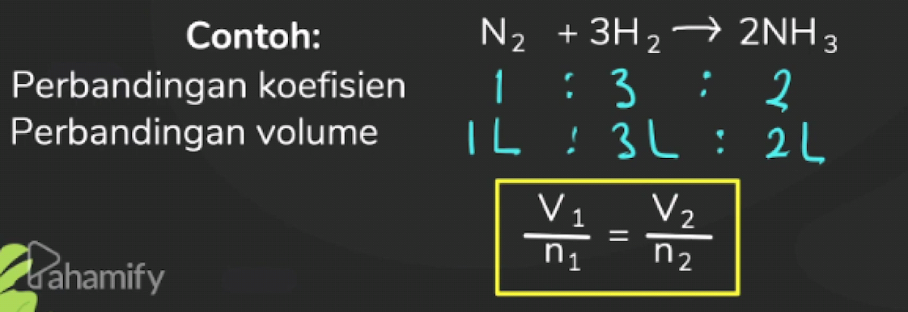
-  Hipotesis Avogadro
   >  -  **Pada P dan T sama, semua gas bervolume sama mengandung jumlah molekul yang sama**
   
   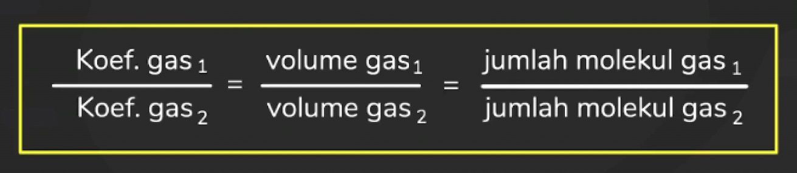
   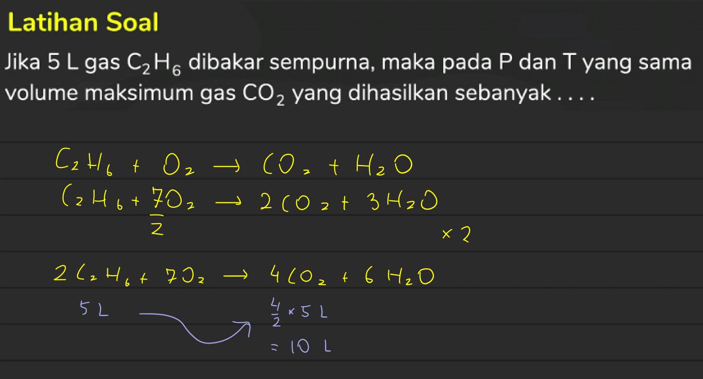
---
---
---
## Soal & Pembahasan
 1. 
  > - 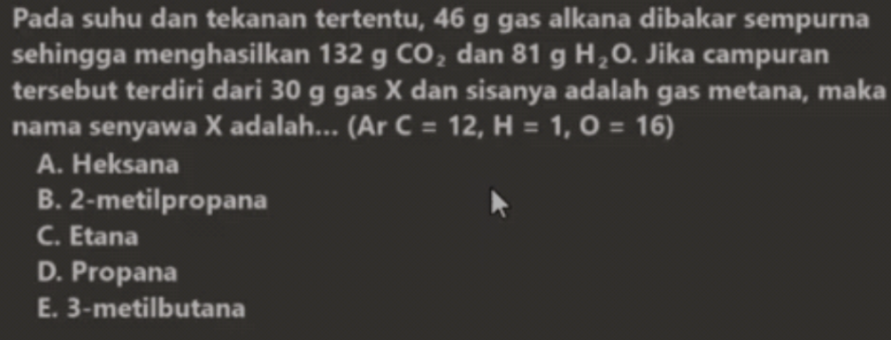
  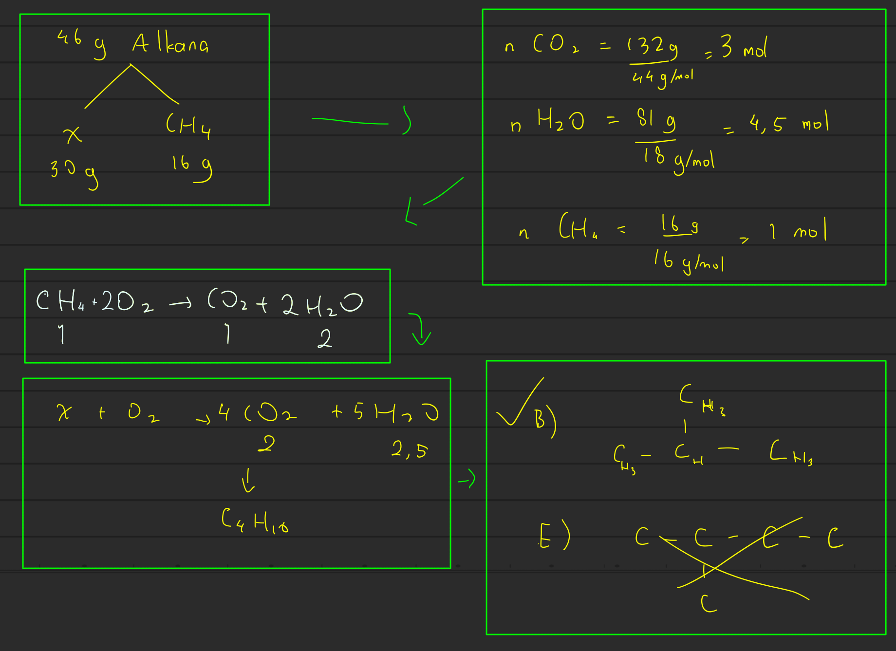
  
2.  
  > - 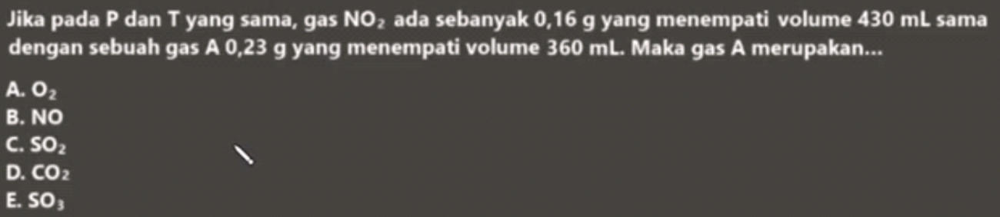

3. 
  
  > - 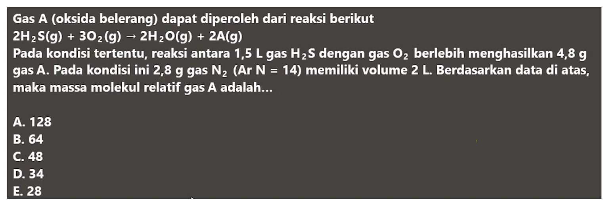
    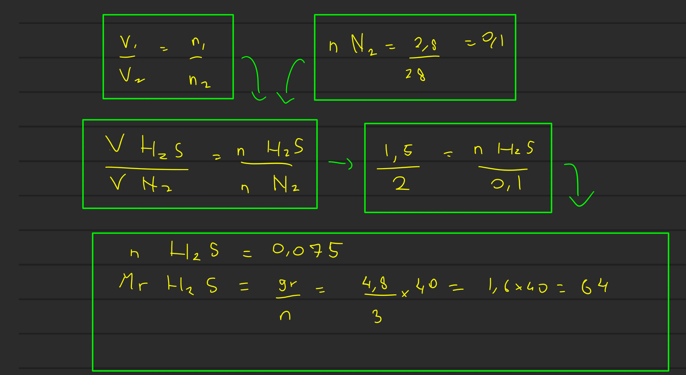