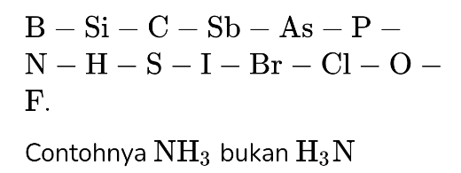
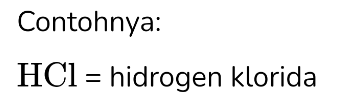
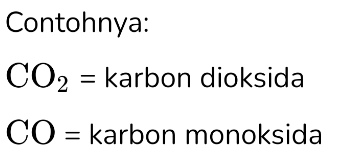
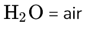

# Tata Nama Senyawa dan Hukum Dasar Kimia
Saat ini sudah banyak senyawa yang dikenal dan ditemukan. IUPAC (International Union of Pure and Applied Chemistry) merumuskan tata nama kimia yang didasarkan pada aturan yang sudah dibuat, dengan tujuan keseragaman.

## Tata Nama Senyawa Anorganik
1. Senyawa molekul (senyawa kovalen) biner
   - Rumus senyawa
    Unsur yang terdapat lebih dulu dalam urutan berikut ditulis di depan.
    
   - Nama senyawa 
    Rangkaian nama kedua jenis unsur dengan akhiran -ida pada unsur kedua. 
    
    Jika pasangan unsurnya membentuk lebih dari satu senyawa, angka indeksnya disebut dalam bahasa yunani tapi awalan mono tidak disebut untuk unsur pertama. 
    
   - Senyawa yang sudah umum dikenal
    Tidak perlu mengikuti aturan tersebut. Contohnya:
    