# Wednesday, May 19, 2021

# Ikatan Kimia

## Jenis Ikatan
- Ikatan Ionik
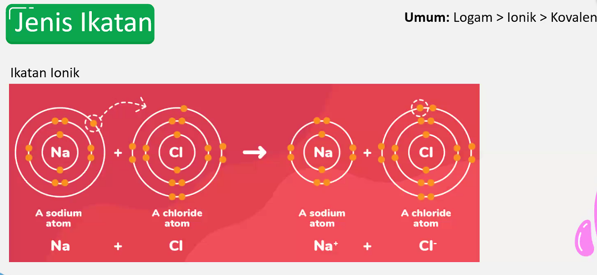
- Ikatan Kovalen
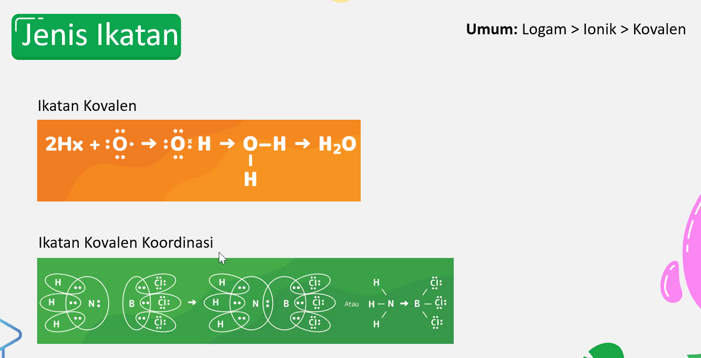
  - Pemakaian elektron bersama.
  - Non-logam.
- Ikatan Kovalen Koordinasi

  - Elektron yang yang dipakai bersama-sama / hanya berasal dari 1 atom.
- Ikatan logam
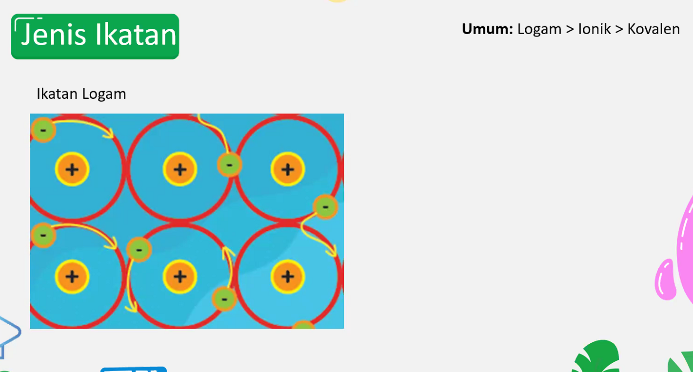
  - Terdelokalisasi.
  - Membentuk awan elektron.
  - Mobile / mudah bergerak.
  - Konduktor listrik.
- Enggak dipelajari di SMA
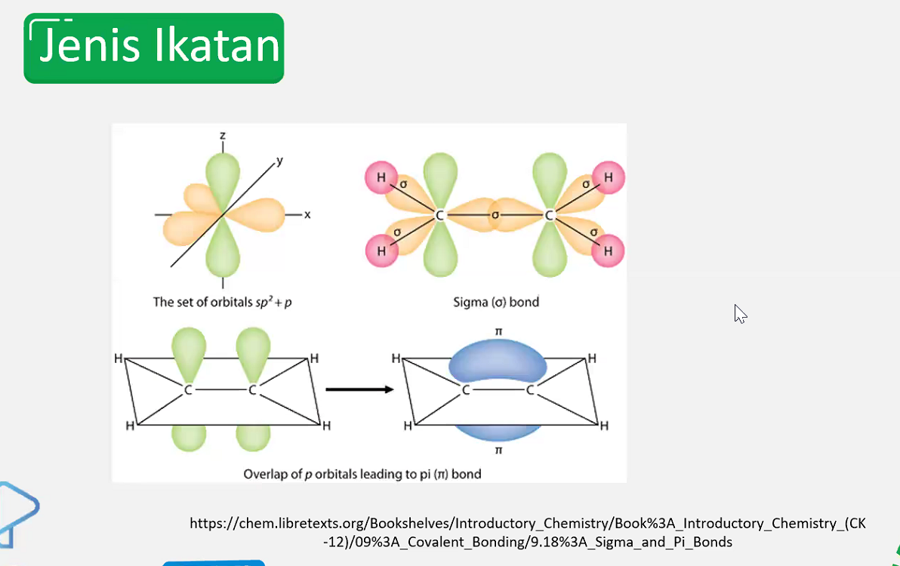
  - Ikatan Sigma
    - Semua ikatan berasal dari ikatan sigma
  - Ikatan Pi
    - Hasil dari paralel
    - Orbital saling mengait
    - Biasanya terbentuk di ikatan-ikatan rangkap / ganda
    - Misal:
  - Misal: 
    - C - C ==> ikatan sigma
    - C = C ==> ikatan pi
---
## Aturan Oktet

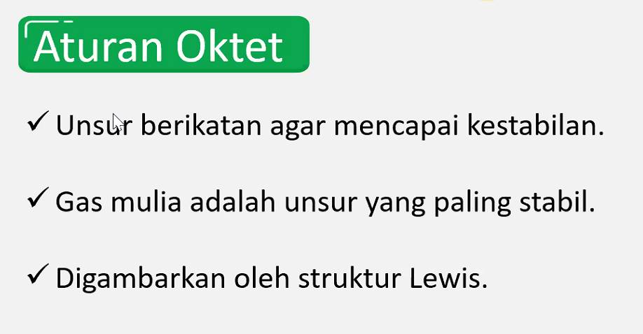

- Pengecualian Aturan Oktet
  1. 
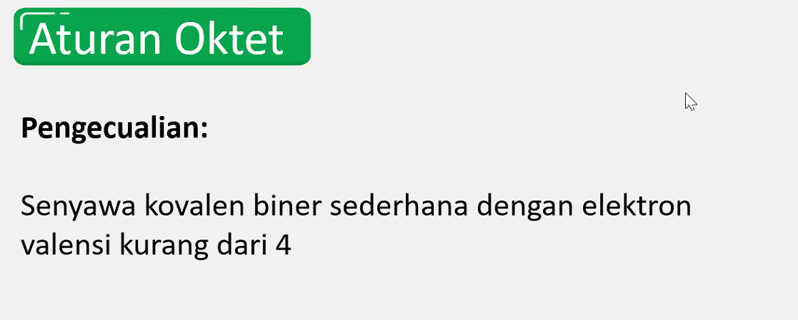
  2. 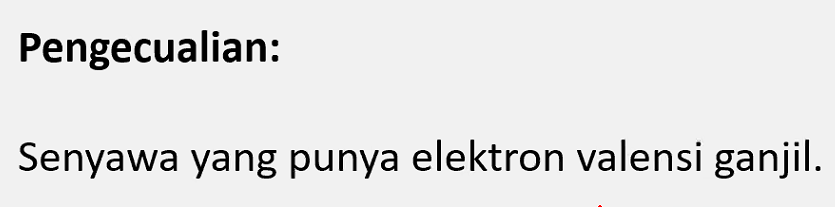
     - ex: atom elektron ganjil berikatan dengan atom elektron valensi genap
     - 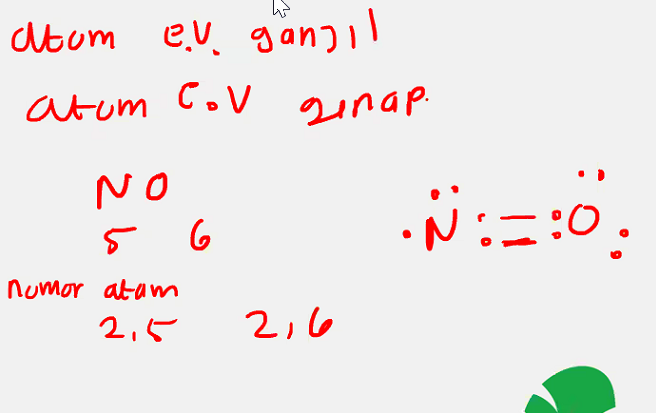
  
3. 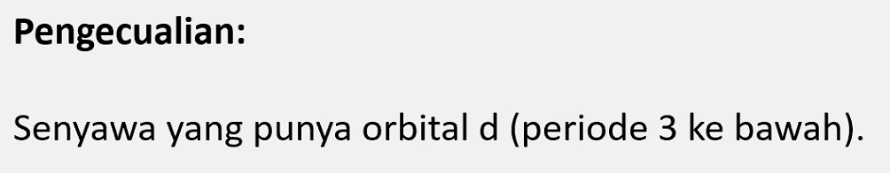
4. 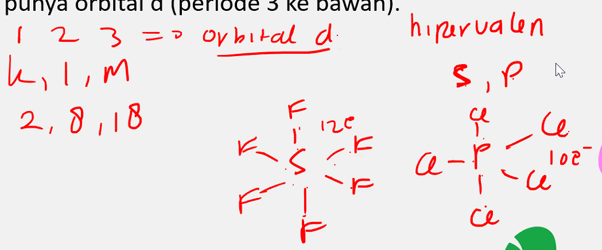
---
## Geometri Molekul
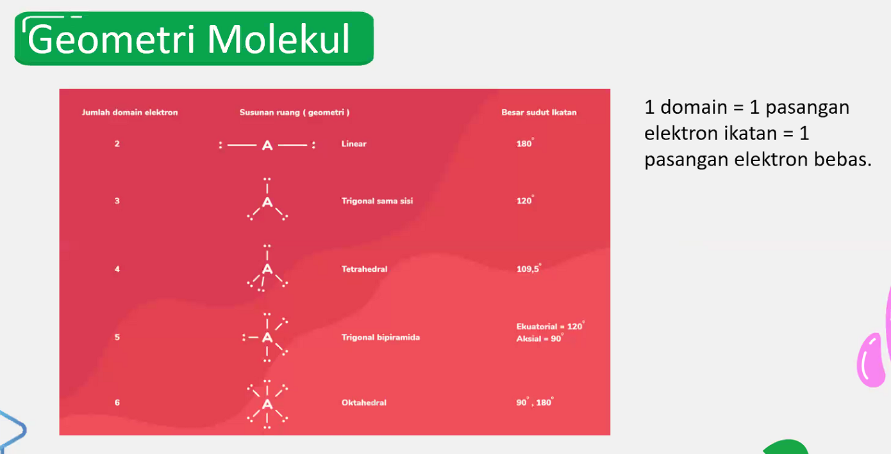
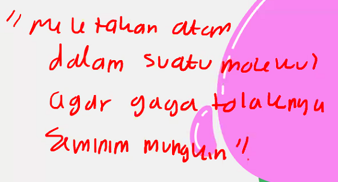
> ## Molekul harus stabil

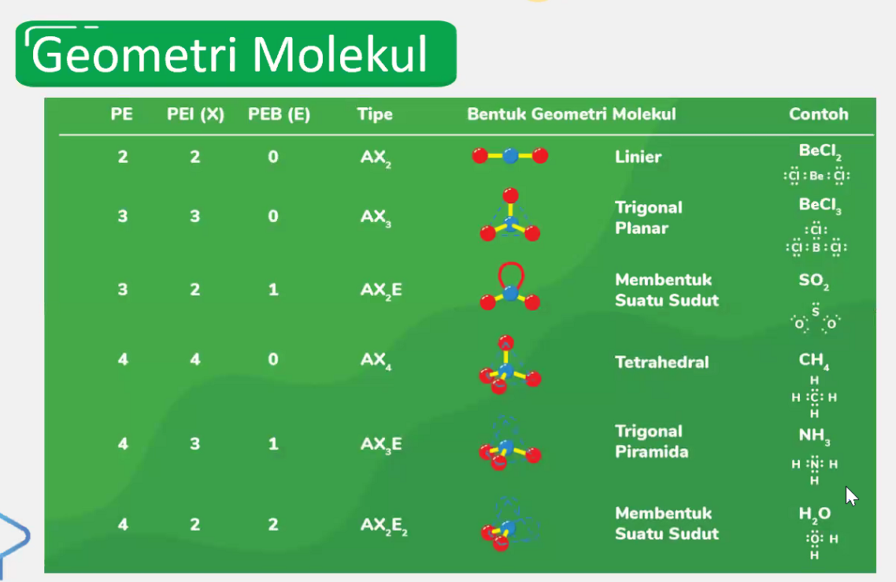
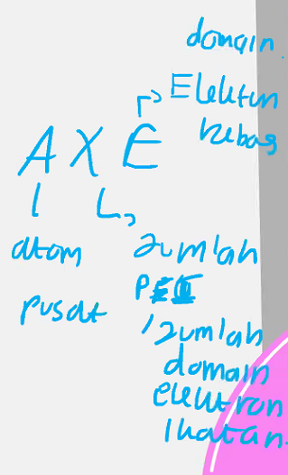
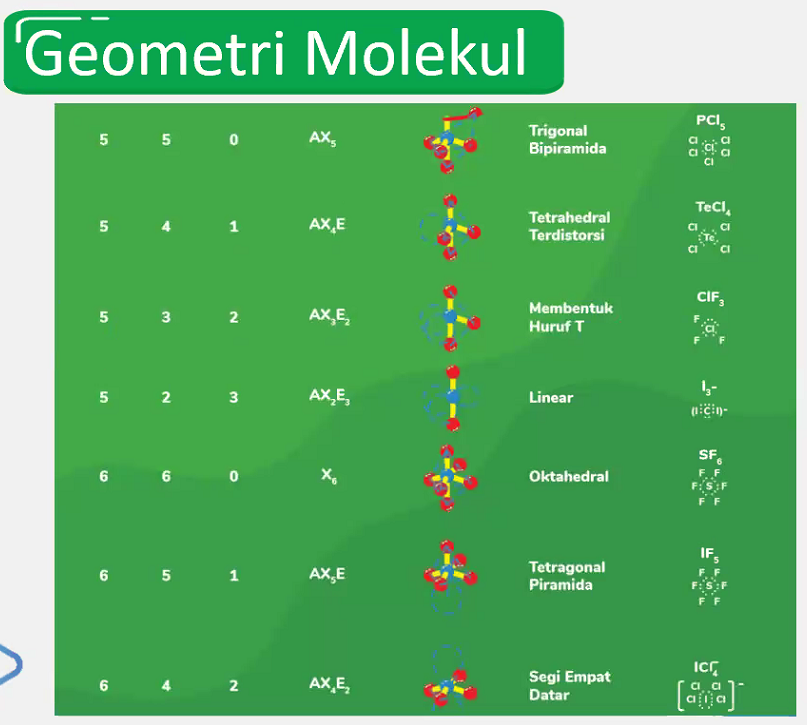
---
## Kepolaran
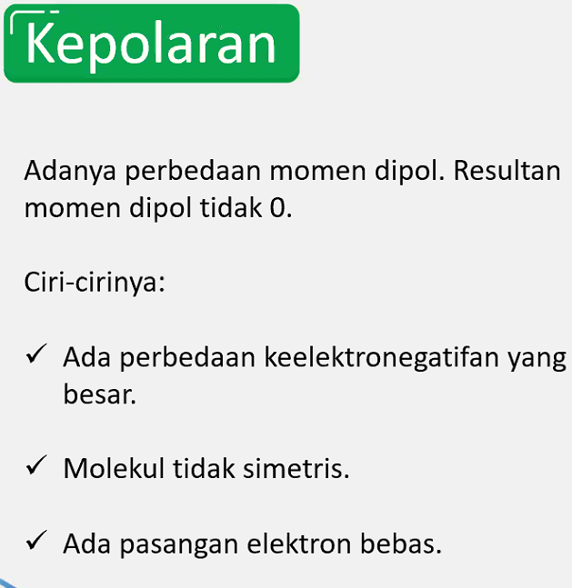
---
## Gaya Antarmolekul
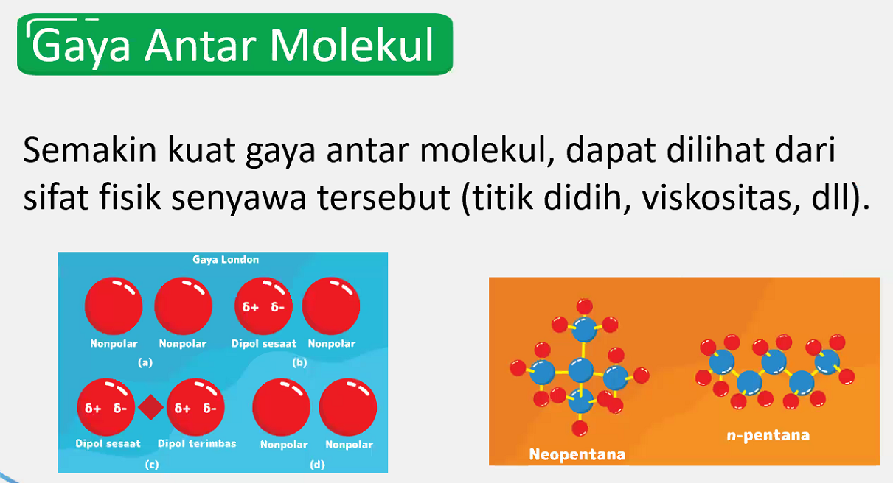
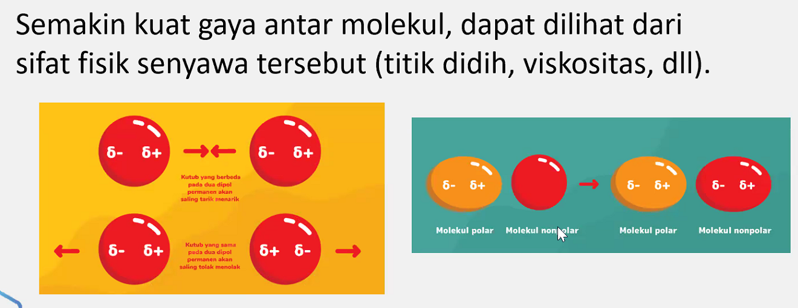
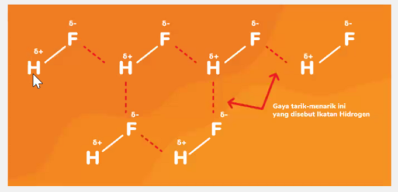
---
## Latihan Soal
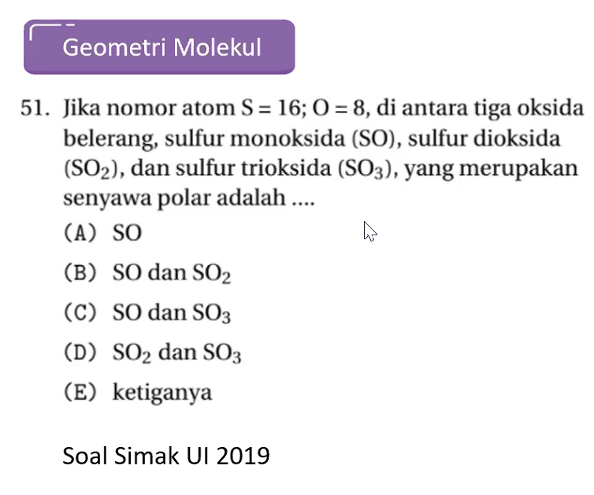
