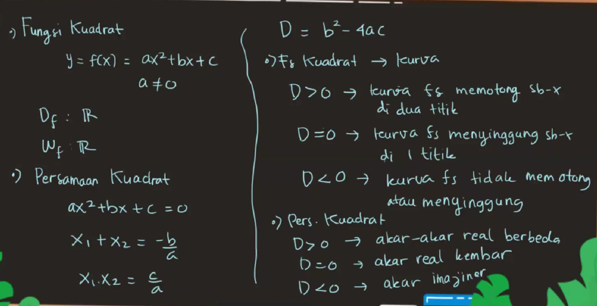
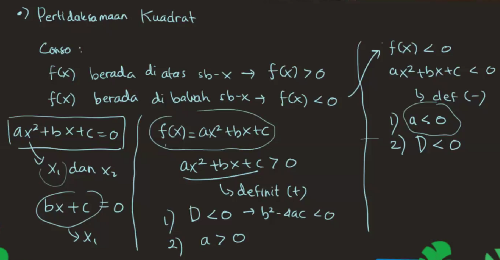
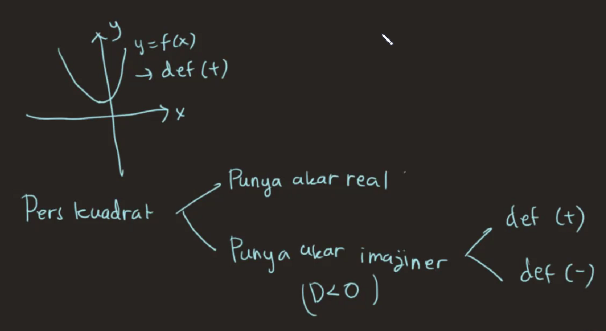
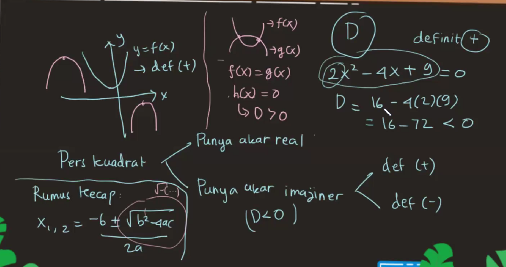
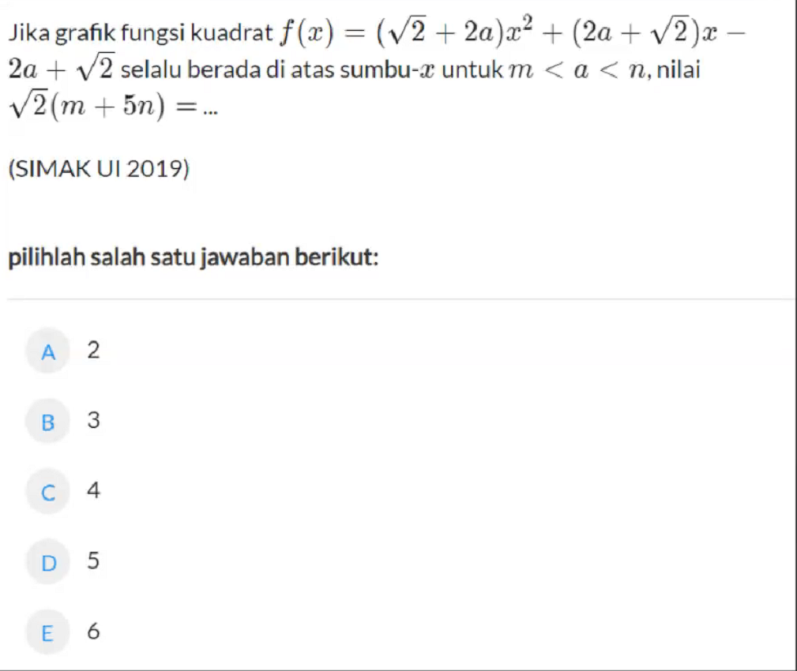
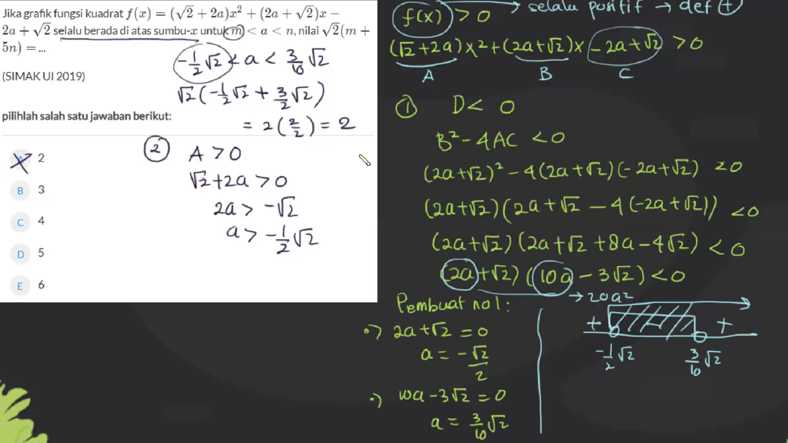
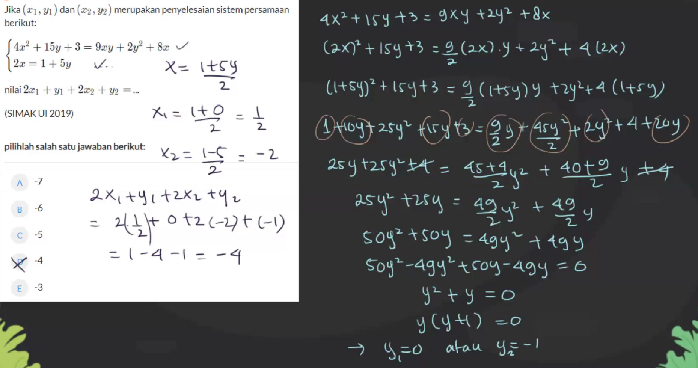

# Thursday, May 20, 2021

# Fungsi, Persamaan, Pertidaksamaan Kuadrat

- ## Fungsi Kuadrat
> $$y = f(x) = ax^2+bx+c $$
> $$ a  \not= 0 $$
> $$D_f : R$$
> $$W_f : R$$
- ##Persamaan Kuadrat
> $$ax^2+bx+c=0$$
> $$x_1+x_2=-b/$$

